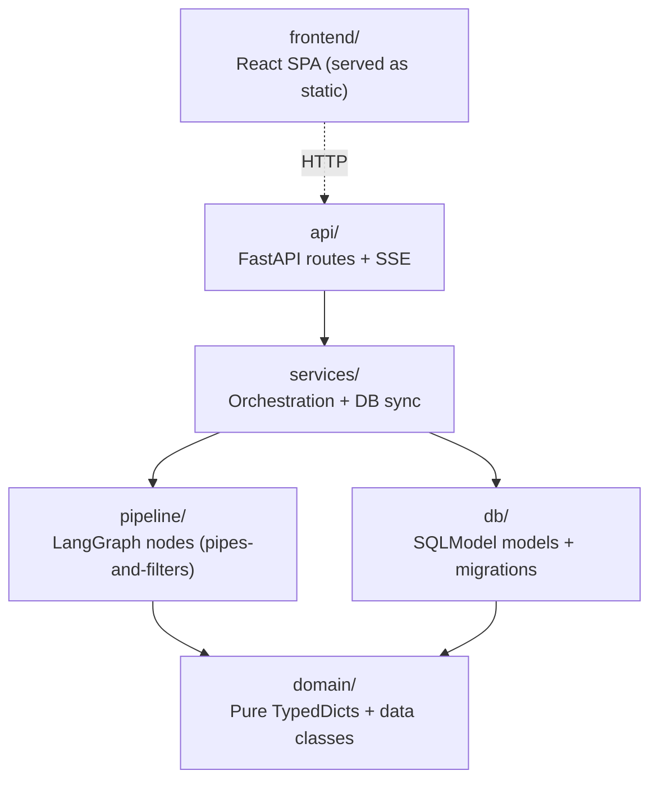

# Architecture Spine — yt.flow

## Design Paradigm

**Layered** (outer) with **pipes-and-filters** (inner at `pipeline/`).



Dependency direction is strictly downward. `pipeline/` nodes never import `db/`. `api/` never imports `pipeline/` directly — always through `services/`.

## Invariants & Rules

### AD-1 — Layer dependency direction

- **Binds:** all modules
- **Prevents:** pipeline nodes touching DB; API calling LangGraph directly
- **Rule:** Import path must follow `api → services → (pipeline | db) → domain`. Any cross-layer import is forbidden.

### AD-2 — LangGraph state is the single source of truth

- **Binds:** F1, F5, F6
- **Prevents:** two competing truth sources for pipeline data; sync bugs between LangGraph state and DB
- **Rule:** All in-flight pipeline data (scenes, artifact paths, gate_states, scenario output) lives in `PipelineState` (TypedDict), persisted by LangGraph `AsyncSqliteSaver`. The `runs` table is a read-optimised API projection only — it mirrors `status`, `current_stage`, `gate_states` and must never be the write-authoritative store for pipeline state.

### AD-3 — Gate mechanism is LangGraph `interrupt()`

- **Binds:** F1 (FR-9), F5 (FR-29)
- **Prevents:** custom polling gate nodes; gate state managed outside LangGraph; dual-write ambiguity on `gate_states`
- **Rule:** Every gate node (in `gates.py`) calls `interrupt({"stage": stage_name})` and returns `{"gate_states": {stage: "pending"}}` as its state update — gate nodes are the sole writers of `gate_states` into `PipelineState`. On resume, `Command(resume="approved" | "rejected")` is passed; the gate node returns `{"gate_states": {stage: "approved" | "rejected"}}`. `services/` mirrors `gate_states` to the `runs` table only after receiving the LangGraph confirmation event — `services/` never writes `gate_states` independently. Graph topology is fixed: all 5 gate nodes always present, regardless of OQ-8 outcome.

### AD-4 — `services/` owns DB sync and SSE fan-out

- **Binds:** F1, F5, F6
- **Prevents:** nodes emitting SSE events directly; DB writes scattered across layers; DB/LangGraph state desync on gate resume
- **Rule:** `services/` is the **only layer permitted to call `graph.astream()` or `graph.update_state()`** — `api/routes/` never calls LangGraph directly. `services/` consumes `graph.astream()` events, then (a) updates `runs` table projection and (b) pushes to the per-run `asyncio.Queue`. DB updates happen **after** LangGraph emits the first confirmation event — never before. `POST /gate` returns 202 Accepted once LangGraph resume is kicked off; the client confirms stage progression via SSE `stage_entry`. If `astream()` raises, `services/` catches it, sets `runs.status = "failed"`, and pushes a `run_failed` SSE event before closing the loop. Pipeline nodes are pure functions of `PipelineState` — no side-effects to DB or queues. `current_stage` is set only by stage nodes in their `PipelineState` return dict; `services/` mirrors it to `runs.current_stage` from the LangGraph event.

### AD-5 — Shot is the image-generation unit; N:M sentence mapping (LLM-Director pattern)

- **Binds:** F1 (FR-2, FR-3), domain/state.py
- **Prevents:** per-scene single-image oversimplification; fixed sentence-per-shot assumptions; `image_node` branching on unpopulated camera fields
- **Rule:** `ShotData.sentence_indices: list[int]` maps each shot to one or more narration sentences (0-based). `scenario_node` prompts DeepSeek V4 as Director — shot boundaries are determined by narrative/camera shift, not sentence count. One sentence may span multiple shots (split); multiple sentences may share one shot (merge). `scenario_node` is **required** to populate `camera_angle` and `camera_movement` for every `ShotData` it emits; `None` is only permitted when the LLM explicitly omits them. `image_node` must handle `None` camera fields gracefully (use defaults, never crash).

### AD-6 — A/B testing is two independent runs linked by `ab_pair_id`

- **Binds:** F4 (FR-18–23), F5 (FR-27)
- **Prevents:** a single branching LangGraph graph for variants; state schema bifurcation
- **Rule:** `POST /runs/{id}/ab` creates a second independent run with the same `scp_text`, `prompt_variant="B"`, and `ab_pair_id` pointing to the originating run. Evaluation reads both LangGraph states after both complete. No graph-level branching.

### AD-7 — Single SQLite file; no scenes table; AsyncSqliteSaver

- **Binds:** F6
- **Prevents:** separate DB files for LangGraph checkpoints and app data; artifact path duplication in DB; event-loop blocking from sync SQLite writes
- **Rule:** Use `AsyncSqliteSaver` (`langgraph.checkpoint.sqlite.aio`) — not the sync `SqliteSaver` — to avoid blocking FastAPI's async event loop. LangGraph checkpoints and SQLModel models share one SQLite file (separate tables). Artifact paths live only in `PipelineState` — no `scenes` or `artifacts` table. `GET /runs/{id}/stages/{stage}/artifacts` reads LangGraph state, not the DB.

### AD-8 — Artifact text edits go through `graph.update_state()`

- **Binds:** F5 (FR-34), F7 (FR-44)
- **Prevents:** artifact files and LangGraph state diverging after inline edits
- **Rule:** `PATCH /runs/{id}/stages/{stage}/artifact` calls `graph.update_state()` to persist the edit into the LangGraph checkpoint, then rewrites the artifact file on disk. Valid for `scenario` and `subtitle` stages only.

### AD-9 — Stage retry rewinds via `graph.update_state()` + re-invoke

- **Binds:** F5 (FR-30), F7 (FR-41)
- **Prevents:** two implementors using incompatible retry strategies (new thread vs state nullification)
- **Rule:** `POST /runs/{id}/stages/{stage}/retry` calls `graph.update_state(config, nullified_stage_state, as_node=stage)` to zero out that stage's outputs in the checkpoint (e.g., image paths → `None`), then calls `graph.astream(None, config)` to re-execute from that node. No new LangGraph thread is created; the original thread's checkpoint is mutated in-place.

### AD-10 — Operational envelope

- **Binds:** F1, F5, F6, deployment
- **Prevents:** undiscoverable workspace path; silent Langfuse failures blocking pipeline
- **Rule:** `workspace/` root is configurable via `YTFLOW_WORKSPACE_PATH` (default: `./workspace`). Langfuse tracing failures are non-fatal — log the error and continue; pipeline must not fail due to observability unavailability. ComfyUI reachability is checked eagerly at `image_node` entry, not at app startup.

## Consistency Conventions

| Concern | Convention |
|---------|------------|
| Naming — files | `snake_case` modules; `PascalCase` TypedDicts/models; stage name literals: `scenario`, `image`, `tts`, `subtitle`, `video` |
| Naming — API routes | `kebab-case` path segments; nouns for resources, verbs only in sub-resources (`/gate`, `/retry`, `/ab`) |
| IDs | UUID v4 strings everywhere; never auto-increment integers as primary keys |
| Timestamps | `datetime.utcnow().isoformat()` stored as TEXT in SQLite |
| Error shape | FastAPI `HTTPException` with `detail: str`; pipeline errors additionally carry `stage` and `run_id` |
| State mutation | `PipelineState` fields replaced wholesale per node return — no in-place mutation; no reducers (sequential pipeline) |
| Config | Pydantic `BaseSettings` in `config.py`; env prefix `YTFLOW_`; model identifiers pinned in config, never hardcoded |
| Langfuse tracing | Every node decorated with `@observe`; span name = stage name literal |
| SSE events | Four event types: `stage_entry`, `stage_exit`, `gate_pending`, `run_failed` |
| `gate_states` format | Flat JSON dict: `{"scenario": "approved", "image": "pending", ...}` — string values only; never an array |
| `current_stage` writer | Set only by stage nodes in their `PipelineState` return dict; `services/` mirrors to DB — never set by `services/` independently |
| SCP data | `data/scps.json` committed to repo; loaded into memory at app startup via FastAPI lifespan (`app.state.scps`); `GET /scps` filters in-memory — no per-request file I/O |

## Stack

| Name | Version |
|------|---------|
| Python | 3.12 |
| LangGraph | 1.2.6 |
| langgraph-checkpoint-sqlite | separate package; provides `AsyncSqliteSaver` at `langgraph.checkpoint.sqlite.aio` |
| FastAPI | 0.115.x |
| SQLModel | 0.0.38 |
| Alembic | 1.x |
| Langfuse (self-hosted) | latest stable |
| langfuse Python SDK | 4.x (4.12.0+) |
| DeepSeek V4 | via OpenAI-compatible client |
| Qwen TTS | cloud API (latest) |
| ComfyUI | local HTTP, version pinned in config |
| React | 18.x |
| shadcn/ui + Tailwind | latest stable |
| uv | package manager |

## Structural Seed

```
yt.flow/
├── src/yt_flow/
│   ├── domain/
│   │   └── state.py          # PipelineState, SceneState, ShotData TypedDicts
│   ├── pipeline/
│   │   ├── graph.py          # StateGraph construction + AsyncSqliteSaver wiring
│   │   ├── gates.py          # gate nodes (separate StateGraph nodes calling interrupt())
│   │   └── nodes/            # pure stage nodes — testable without LangGraph runtime
│   │       ├── scenario.py   # DeepSeek V4 Director → scenes[]
│   │       ├── image.py      # shots → ComfyUI → ShotData.image_path
│   │       ├── tts.py        # narration → Qwen TTS → audio_path + word_timings
│   │       ├── subtitle.py   # forced alignment → subtitle_path
│   │       └── video.py      # scene assets → FFmpeg → video_path
│   ├── services/
│   │   ├── run_service.py    # astream() driver; DB sync; SSE queue fan-out
│   │   └── eval_service.py   # A/B evaluation orchestration
│   ├── db/
│   │   ├── models.py         # SQLModel: Run
│   │   └── migrations/       # Alembic
│   ├── api/
│   │   ├── main.py           # FastAPI app + static mount (/app)
│   │   ├── sse.py            # asyncio.Queue registry per run_id
│   │   └── routes/
│   │       ├── runs.py       # CRUD, gate, retry, ab, artifact PATCH
│   │       ├── scps.py       # GET /scps from data/scps.json
│   │       └── progress.py   # SSE endpoint
│   └── config.py             # Pydantic BaseSettings (YTFLOW_*)
├── frontend/                 # React SPA (shadcn/ui + Tailwind)
│   └── dist/                 # built output; served at /app
├── data/
│   └── scps.json             # local SCP facts file
├── workspace/                # runtime artifact root (per run_id subdirs)
├── yt_flow.db                # single SQLite (SQLModel tables + LangGraph checkpoints)
└── pyproject.toml
```

## LangGraph Graph Structure

Stage nodes are pure functions of `PipelineState` (testable without LangGraph runtime). Gate nodes are separate StateGraph nodes in `gates.py` that call `interrupt()` — they are not part of the stage node itself.

```mermaid
graph LR
    START --> scenario
    scenario["scenario\n(pure node)"] --> gate_scenario["gate_scenario\n(interrupt)"]
    gate_scenario -->|approved| image
    gate_scenario -->|rejected| END
    image["image\n(pure node)"] --> gate_image["gate_image\n(interrupt)"]
    gate_image -->|approved| tts
    gate_image -->|rejected| image
    tts["tts\n(pure node)"] --> gate_tts["gate_tts\n(interrupt)"]
    gate_tts -->|approved| subtitle
    gate_tts -->|rejected| tts
    subtitle["subtitle\n(pure node)"] --> gate_subtitle["gate_subtitle\n(interrupt)"]
    gate_subtitle -->|approved| video
    gate_subtitle -->|rejected| subtitle
    video["video\n(pure node)"] --> gate_video["gate_video\n(interrupt)"]
    gate_video -->|approved| END
    gate_video -->|rejected| video
```



## PipelineState (OQ-7 resolved)

```python
# domain/state.py
class WordTiming(TypedDict):
    word: str
    start_sec: float
    end_sec: float

class ShotData(TypedDict):
    shot_id: str                  # "S001" — stable within scene
    sentence_indices: list[int]   # 0-based, N:M mapping (LLM-Director / CoAgent pattern)
    image_prompt: str
    negative_prompt: str
    camera_angle: str | None      # "medium" | "close-up" | "wide" | ...
    camera_movement: str | None   # "static" | "pan" | "zoom" | ...
    image_path: str | None        # set by image_node

class SceneState(TypedDict):
    scene_num: int
    narration: str
    shots: list[ShotData]
    audio_path: str | None
    audio_duration: float | None
    word_timings: list[WordTiming]
    subtitle_path: str | None

class PipelineState(TypedDict):
    run_id: str
    scp_text: str
    scenes: list[SceneState]      # built by scenario_node; extended per stage
    video_path: str | None
    current_stage: str            # scenario|image|tts|subtitle|video
    gate_states: dict[str, str]   # stage → pending|approved|rejected|n/a
    prompt_variant: str | None    # "A" | "B" | None
    error: str | None
```

## runs Table (OQ-3 resolved)

```python
# db/models.py
class Run(SQLModel, table=True):
    id: str = Field(primary_key=True)   # UUID
    scp_id: str                          # "SCP-096"
    status: str                          # running|awaiting_approval|complete|failed
    current_stage: str | None
    gate_states: str | None              # JSON blob
    prompt_variant: str | None
    ab_pair_id: str | None               # links A/B pair
    error: str | None
    started_at: str
    updated_at: str
```

## Deferred

| Item | Deferred until |
|------|---------------|
| OQ-1 — LLM-as-judge evaluation axes | Before F4 implementation |
| OQ-2 — ComfyUI workflow JSON baseline | Before FR-3 implementation |
| OQ-5 — Generic pipeline future scope | Post-MVP |
| OQ-6 — A/B winner threshold | Before FR-23 implementation |
| ~~OQ-8~~ — Gate scope resolved: all 5 gates always present, fixed topology (AD-3) | Closed |
| Scene-level resume granularity | Accepted trade-off: node-level only |
